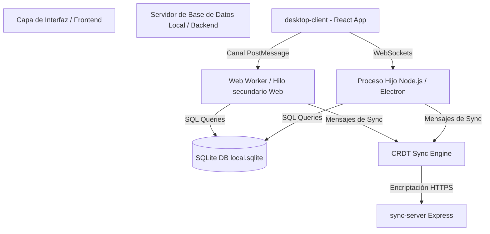
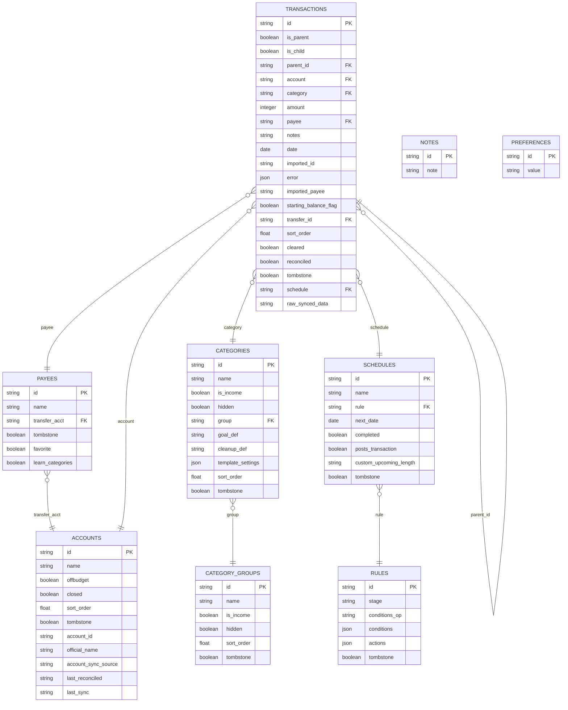

# Manual de Entorno y Arquitectura: Proyecto de Pruebas de Software (Actual Budget)

Bienvenido al repositorio oficial del proyecto de pruebas de software para **Actual Budget**. Este espacio está dedicado al análisis de calidad, automatización de pruebas y aseguramiento del núcleo financiero del sistema (`packages/loot-core`), desarrollado por el **Grupo 3 (Cigarras)** para el curso de Pruebas de Software de la **Universidad Nacional de San Agustín (UNSA)**.

---

## Presentación del Equipo (Grupo 3 - Cigarras)

*   **Calcina Flores, Franco** (`FrancoCalcinaFlores`) — Alineamiento y Verificación / *QA Reviewer*
*   **Choquehuanca Zapana, Hernan Andy** (`hz07s`) — Programador de Tests / *Líder de Sprint 2 (Co)*
*   **Larico Rodriguez, Bryan Fernando** (`BryanLarico`) — Programador de Tests / *Líder de Sprint 3 (Co)*
*   **Maldonado Vilca, Victor Gonzalo** (`Victor-Gonzalo-Maldonado-Vilca`) — Programador de Tests / *Líder de Sprint 2 (Co)*
*   **Nina Calizaya, Rafael Diego** (`DrN25`) — Programador de Tests / *Líder de Sprint 1*
*   **Suclle Suca, Michael Benjamin** (`MichaelSucSuc`) — Documentación y Calidad / *QA/Doc*

---

## 1. ¿Qué es y Para qué sirve?

### ¿Qué es?
Es un gestor de finanzas personales multiplataforma (Web y Escritorio) de código abierto y gratuito, diseñado bajo la filosofía **local-first** (prioridad local). Toda la información se procesa y guarda localmente en el dispositivo del usuario en una base de datos SQLite y se sincroniza opcionalmente de forma cifrada de extremo a extremo a través de un servidor de sincronización intermediario.

### ¿Para qué sirve?
*   **Planificación Financiera Activa:** Permite aplicar la metodología de presupuesto de base cero (cada centavo tiene un trabajo: *zero-based budgeting*).
*   **Control de Cuentas y Transacciones:** Rastreo detallado de cuentas bancarias (tanto de presupuesto como fuera de presupuesto/*off-budget*), importación de transacciones e historial.
*   **Automatización mediante Reglas:** Permite crear reglas personalizadas basadas en condiciones para categorizar transacciones, rellenar descripciones, etc.
*   **Schedules e Ingresos Recurrentes:** Planificar transacciones futuras y cobros cíclicos.
*   **Privacidad Absoluta:** Al priorizar el almacenamiento local y la encriptación de extremo a extremo, los datos del usuario no se venden ni se exponen a terceros.

---

## 2. Arquitectura y Cómo Funciona
El sistema está diseñado de forma descentralizada bajo un modelo de base de datos local y sincronización basada en **CRDT** (Conflict-free Replicated Data Types) que permite resolver conflictos de forma automática cuando varios dispositivos modifican los mismos datos en momentos distintos.

Para evitar que las consultas a la base de datos local o los cálculos matemáticos del presupuesto congelen la interfaz de usuario, el sistema desacopla el frontend del backend local:



### Arquitectura de Ejecución
1.  **En la versión Web:**
    El frontend (React) se comunica con un **Web Worker** en segundo plano. Esto asegura que la base de datos (SQLite compilado a WebAssembly a través de `sql.js` y persistida en IndexedDB con `absurd-sql`) corra en otro hilo y no bloquee el renderizado de la interfaz gráfica, manteniendo la aplicación fluida.
2.  **En la versión de Escritorio (Electron):**
    La UI de React se ejecuta en el proceso de renderizado de Electron, y el servidor de base de datos local corre en un **proceso hijo de Node.js** que usa `better-sqlite3`. La comunicación entre la UI y el proceso de fondo se realiza mediante un canal seguro de **WebSockets** locales.
3.  **Mecanismo de Persistencia y Sincronización:**
    Toda acción de base de datos se traduce en mensajes CRDT. Cuando el usuario modifica un registro, este cambio se emite localmente y se encola para subirse de manera encriptada a `sync-server`.

---

## 3. Estructura de Módulos (Monorepo)
Actual se organiza como un monorepo gestionado por **Yarn 4 Workspaces** y el ejecutor de tareas **Lage**. Los módulos clave dentro de `packages/` son:

| Paquete | Alias/Nombre de Workspace | Propósito |
| :--- | :--- | :--- |
| `loot-core` | `@actual-app/core` | El núcleo del sistema: lógica de negocio, base de datos local, migraciones, sincronización, y AQL. |
| `desktop-client` | `@actual-app/web` | Interfaz de usuario en React. Desarrollado con Vite, componentes funcionales e i18n. |
| `desktop-electron` | `desktop-electron` | Envoltorio para la aplicación nativa utilizando Electron (gestión de ventanas, ciclo de vida e integración con el SO). |
| `api` | `@actual-app/api` | API de Node.js pública que permite a los desarrolladores escribir scripts para interactuar con sus presupuestos. |
| `sync-server` | `@actual-app/sync-server` | Servidor backend en Express encargado de centralizar y propagar de forma segura los archivos encriptados y metadatos CRDT. |
| `component-library` | `@actual-app/components` | Biblioteca interna de componentes visuales compartidos (Button, Input, Icons, etc.) y temas visuales. |
| `crdt` | `@actual-app/crdt` | Implementación del protocolo de replicación libre de conflictos y serialización en Protocol Buffers. |
| `plugins-service` | `plugins-service` | Gestor y cargador del sistema de plugins. |
| `eslint-plugin-actual` | `eslint-plugin-actual` | Reglas personalizadas de linter para forzar i18n, uso de loggers seguros en lugar de console.log, etc. |
| `docs` | `docs` | Documentación técnica y guías de usuario creadas con Docusaurus. |

---

## 4. Tecnologías y Dependencias

### Core & Frontend
*   **TypeScript & JavaScript (ES6+):** Tipado estricto en todo el codebase.
*   **React:** Utilizando hooks funcionales y el compilador de React (`babel-plugin-react-compiler`) para auto-memoización.
*   **Vite:** Herramienta de compilación rápida para desarrollo y bundling.
*   **CSS Puro:** Estilización modular y flexible sin depender de frameworks de forma predeterminada.

### Base de Datos y Comunicación
*   **SQLite:** Motor de base de datos local principal.
    *   **Escritorio:** `better-sqlite3` para un excelente rendimiento nativo en C++.
    *   **Web:** `sql.js` (WebAssembly) para acceso a SQLite dentro del navegador.
*   **WebSockets / IPC:** Para comunicación bidireccional entre la UI y el proceso Node de fondo.

### Backend de Sincronización
*   **Node.js (>=22)**
*   **Express:** Para orquestar los endpoints del servidor de sincronización.

---

## 5. La Base de Datos (Estructura y Esquema)

### Funcionamiento de la BD
Actual almacena los datos de cada archivo de presupuesto en un archivo SQLite independiente denominado `db.sqlite`.
Al crear un archivo de presupuesto nuevo:
1.  Se clona una base de datos básica predeterminada (`default-db.sqlite`).
2.  Se ejecuta un set de **migraciones de base de datos** ubicadas en `packages/loot-core/src/server/migrate` para actualizar la base de datos al esquema vigente.
3.  Para consultar o insertar datos se utiliza **Actual Query Language (AQL)**, un compilador interno que optimiza las consultas SQL a través de vistas.

### Vistas Normalizadas (`v_`)
Para evitar acoplamientos rígidos con las tablas físicas (crucial debido a que la sincronización CRDT requiere replicar columnas exactas), Actual monta **vistas SQL** en tiempo de ejecución (ej. `v_transactions`, `v_categories`). Esto permite renombrar u optimizar campos subyacentes sin alterar la estructura física que sincroniza el protocolo CRDT.

### Esquema Detallado de Tablas (AQL)
El esquema relacional mapeado por el core es el siguiente:



---

## 6. Guía de Configuración Local en Windows
Sigue estos sencillos pasos para clonar, instalar dependencias y levantar el entorno de desarrollo y pruebas en Windows:

### Prerrequisitos
*   **Git** instalado en el sistema.
*   **Node.js 22** o superior instalado.
*   **Corepack** activado (incluido por defecto en Node.js).

### Instalación y Sincronización
Ejecuta los siguientes comandos en tu terminal de PowerShell:
```powershell
# 1. Clonar el repositorio del proyecto de pruebas
git clone https://github.com/CigarraAs/actual_testing.git
cd .\actual_testing

# 2. Habilitar y preparar Yarn Berry
corepack enable
corepack prepare yarn@4.13.0 --activate

# 3. Instalar la totalidad de las dependencias locales del monorepo
yarn install
```

### Ejecutar la Aplicación en Windows
Para evitar errores de compatibilidad con scripts Bash, ejecuta las siguientes combinaciones por separado:

*   **Modo Local Simple (Solo navegador sin servidor)**:
    ```powershell
    yarn workspace @actual-app/web start --mode=browser
    ```
*   **Frontend + Servidor de Sincronización**:
    ```powershell
    # Terminal 1: Lanza el servidor backend de sincronización (puerto 5006)
    yarn workspace @actual-app/sync-server start

    # Terminal 2: Lanza la interfaz web de React (puerto 3001)
    yarn workspace @actual-app/web start --mode=browser
    ```
    *Abre en tu navegador la dirección `http://localhost:3001`.*

---

## 7. Estrategia y Control de Calidad
El proyecto utiliza un sistema riguroso para asegurar la integridad de la base de datos y la UI:

### Ejecución de Pruebas Unitarias
> [!WARNING]
> Dado que el motor SQLite de Node.js (`better-sqlite3`) bloquea archivos de forma física, correr pruebas concurrentemente en Windows genera errores `EBUSY` de base de datos ocupada. **Las pruebas del core deben ejecutarse de forma secuencial**:

```powershell
# Ejecución secuencial de la suite con reporte de cobertura
yarn workspace @actual-app/core vitest run --coverage --fileParallelism=false --maxWorkers=1
```

### Métricas de Cobertura de la Línea Base
Tras aplicar las exclusiones lógicas de archivos de soporte en `vitest.config.ts`, la línea base de cobertura inicial es:
*   **Sentencias Totales**: **12,832**
*   **Sentencias Cubiertas**: **7,500 (58.44% Cobertura de Sentencias)**
*   **Cobertura de Ramas**: **50.43%**
*   **Pruebas Existentes**: **664 / 666 pruebas aprobadas con éxito**

### Roadmap de Sprints y Aseguramiento
Nuestra estrategia de testing se divide en 4 sprints de entrega académica:
*   **Sprint 1 (Hito 1)**: Planificación, diseño del PPU (92 casos de prueba), exclusiones de Vitest y despliegue del portal de Pages (Línea Base: **58.44%**).
*   **Sprint 2 (Hito 2)**: Programación y ejecución de Pruebas Unitarias e Integración modular en SQLite (Meta Cobertura: **80.69%**).
*   **Sprint 3 (Hito 3)**: Automatización de Pruebas de Sistema (Playwright E2E), Aceptación BDD y pipeline CI/CD (Meta Cobertura: **86.17%**).
*   **Sprint 4 (Sustentación)**: Cierre de calidad, informe consolidado y redacción de artículo científico IEEE.

---

## 8. Recursos y Enlaces del Proyecto
*   **Wiki del Proyecto**: [GitHub Wiki Oficial](https://github.com/CigarraAs/actual_testing/wiki)
*   **Tablero Kanban de Gestión**: [GitHub Projects Scrum Board](https://github.com/orgs/CigarraAs/projects/2)
*   **Portal de Calidad Interactivo**: [GitHub Pages Web](https://cigarraas.github.io/actual_testing/)

---

## 9. Autor y Licencia
*   **Creador Original:** James Long ([jlongster](https://github.com/jlongster)), quien diseñó y lanzó inicialmente Actual Budget como un producto comercial.
*   **Transición Open Source:** En 2022, el código fue completamente liberado bajo la licencia de código abierto **MIT**.
*   **Mantenimiento Actual:** Actualmente es liderado y mantenido de forma activa por la comunidad de **Actual Budget Open Source** en GitHub.
