# Informe de funcionalidades de Actual Budget

## Introducción

En este informe explico, con palabras sencillas, por qué escogimos Actual Budget como software y qué funciones se pueden ver en las capturas que están dentro de `resources_readme`. La idea es mostrar que no se trata solo de una aplicación para ver números, sino de una herramienta completa para organizar las finanzas personales, controlar gastos y tener una visión más clara del dinero.

Escogimos este software porque es práctico, visual y fácil de entender. También nos llamó la atención que permite trabajar con información financiera de forma ordenada, sin depender tanto de procesos complicados. Además, al ser una aplicación enfocada en la privacidad y en el control local de los datos, da más confianza para manejar información personal.

## Vista general de la aplicación

La primera imagen sirve como una vista general del programa. Ahí se nota que la aplicación tiene una interfaz ordenada, con espacios claros para mostrar la información principal y un menú para moverse entre los módulos. Esto ayuda bastante porque el usuario no se pierde y puede ubicar rápido dónde está cada parte.

	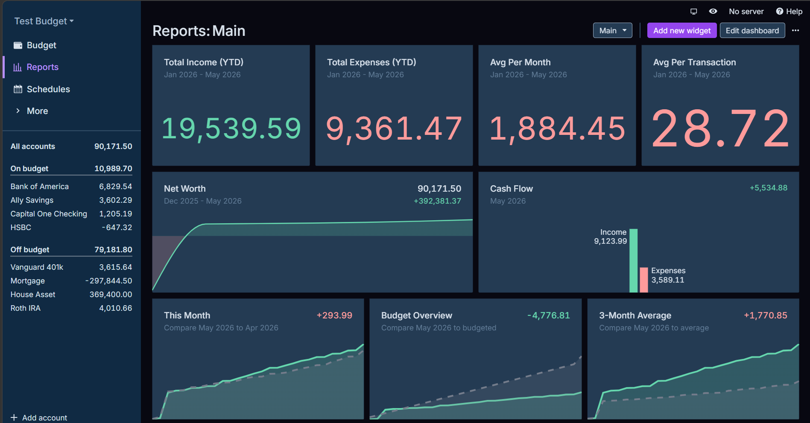

En esta pantalla se puede ver el resumen general del estado financiero. Para nosotros, este tipo de vista es importante porque da una idea rápida de cómo van los ingresos, los gastos y el comportamiento general del dinero. Es una pantalla útil para empezar a revisar la información sin entrar todavía a detalles más específicos.

## Módulo de reportes

El módulo de reportes es uno de los más importantes porque ahí se concentra mucha información resumida. En la imagen se ven gráficos y tarjetas que muestran datos importantes de manera visual. Esto hace que el análisis sea más fácil, porque no todo depende de leer tablas o cifras largas.

	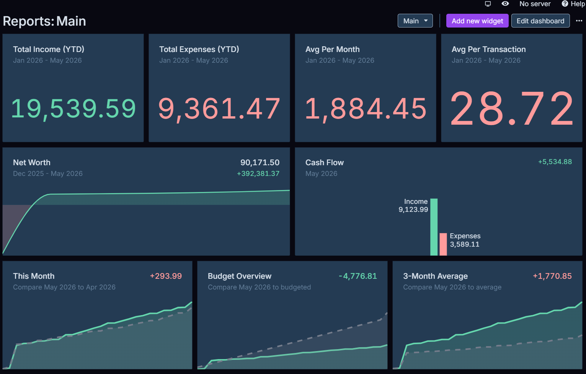

Lo que muestra esta sección es una especie de panel con bloques de información. Cada bloque ayuda a entender una parte distinta de las finanzas, por ejemplo el total de ingresos, el historial de movimientos o las comparaciones entre cuentas. En vez de revisar todo manualmente, la aplicación resume los datos de forma clara.

Una de las cosas que más aporta este módulo es que permite comparar periodos. Así se puede ver si un mes fue mejor que otro, si hubo más gastos de lo esperado o si el dinero se mantuvo estable. Eso es útil para tomar decisiones más conscientes sobre el uso del presupuesto.

	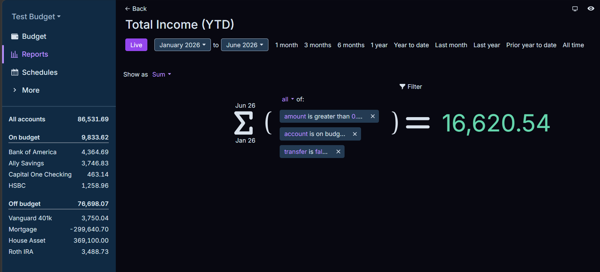

En esta captura se ve el ingreso total. Esta parte sirve para saber cuánto dinero entró en cierto tiempo. Es una función muy útil porque ayuda a revisar si los ingresos alcanzaron para cubrir los gastos o si hubo una diferencia positiva que se pudo ahorrar.

	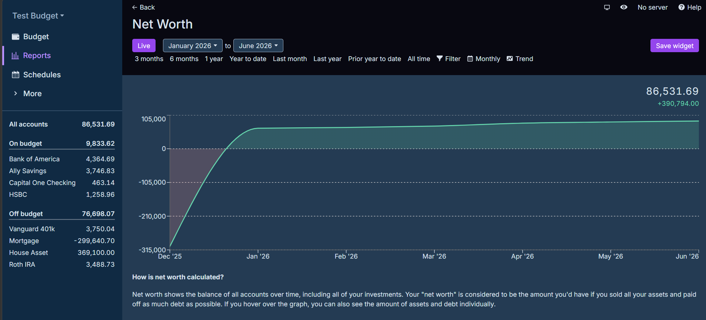

La imagen del historial muestra cómo se fueron moviendo los datos con el tiempo. Esto permite revisar cambios anteriores, detectar movimientos raros y entender mejor la evolución de las finanzas. Desde nuestro punto de vista, esta parte aporta mucho porque no solo enseña el presente, sino también lo que pasó antes.

	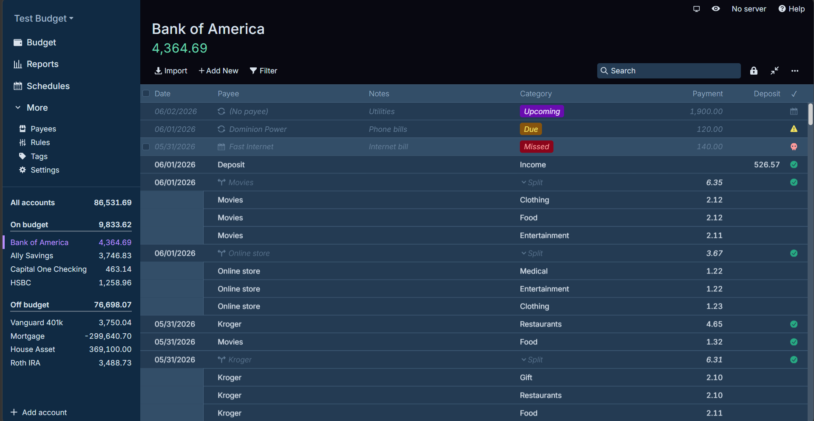

En esta otra captura se ve la información separada por banco o por cuenta. Eso facilita saber dónde está guardado el dinero y cuánto hay en cada lugar. Si una persona tiene varias cuentas, esta función le da una vista más ordenada y ayuda a no mezclar información.

## Módulo de calendario de transacciones

El calendario de transacciones permite ver los ingresos y egresos por fecha. Esta parte nos parece muy útil porque no solo organiza el dinero por categorías, sino también por días, lo que ayuda a identificar cuándo sucedieron los movimientos.

	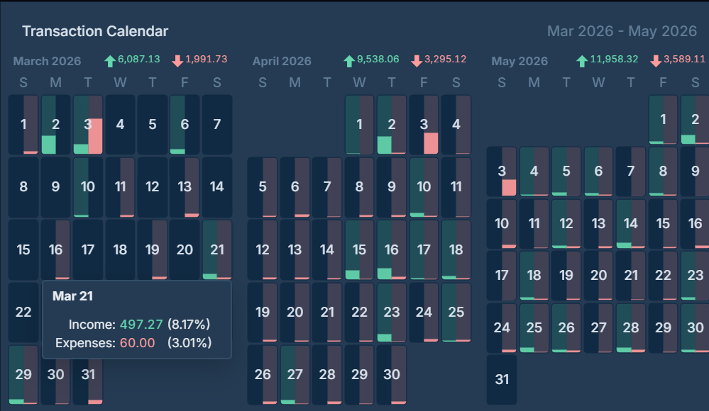

En la imagen se observan los días con barras o marcas que indican movimientos. Esto hace más fácil reconocer días con muchos gastos o días donde entró dinero. En un informe de finanzas esto es valioso porque muchas veces los problemas no se ven de inmediato en una lista, pero sí se notan al revisar el comportamiento por fechas.

	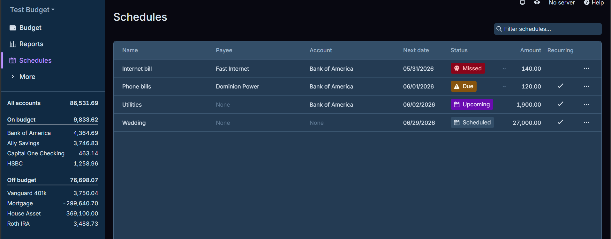

Esta otra captura muestra los pagos programados. Aquí se organizan compromisos que deben cumplirse en fechas específicas. Nos parece una función importante porque ayuda a no olvidar pagos como servicios, cuotas o suscripciones. También permite ver si un pago está vencido, pendiente o todavía por llegar.

## Módulo de todas las cuentas

La sección de todas las cuentas muestra los movimientos de manera más detallada. Aquí ya no se ve solo un resumen, sino una lista con operaciones concretas. Esa vista es importante porque permite revisar exactamente qué pasó con cada transacción.

	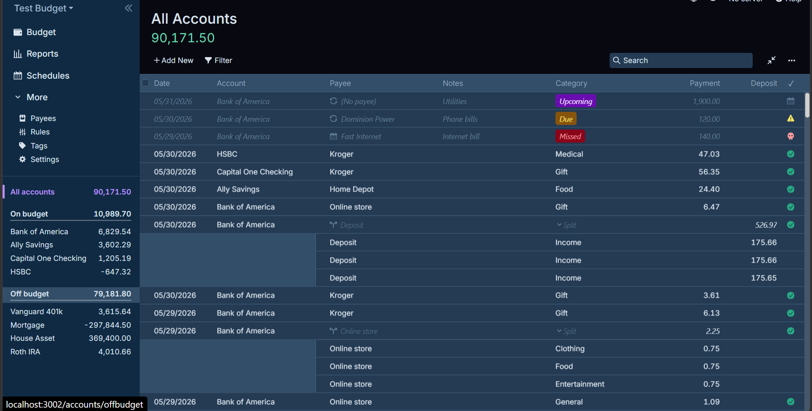

En esta captura se aprecia una lista con transacciones y filtros. Esa organización ayuda mucho cuando el usuario quiere encontrar un movimiento específico. Por ejemplo, puede buscar por cuenta, categoría o estado, lo que hace que la revisión sea más rápida y menos confusa.

	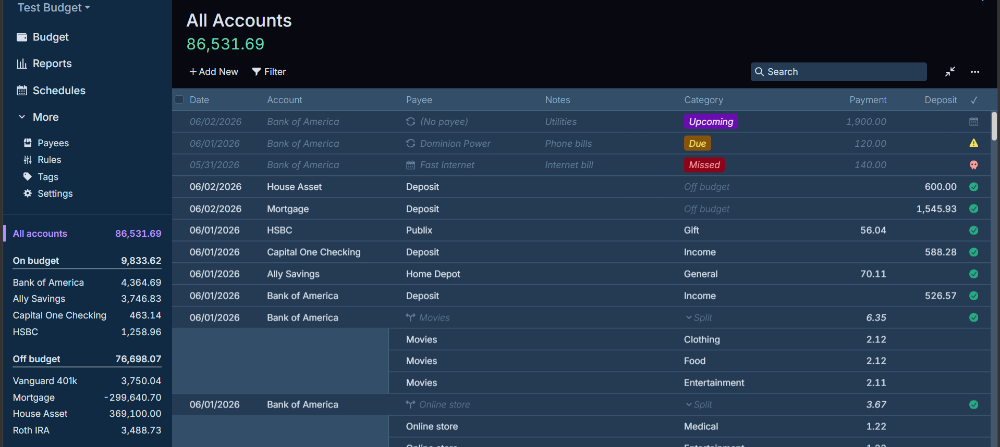

La segunda imagen de esta sección refuerza la idea de control general sobre las cuentas. Aquí se entiende mejor cómo la aplicación agrupa la información para que sea más sencilla de revisar. Esto aporta orden y evita que las transacciones queden dispersas.

## Módulo de beneficiarios

El apartado de beneficiarios sirve para guardar nombres de personas, empresas o lugares con los que normalmente se realizan pagos o movimientos. Esta parte puede parecer sencilla, pero en realidad es muy útil porque ayuda a clasificar mejor las transacciones.

	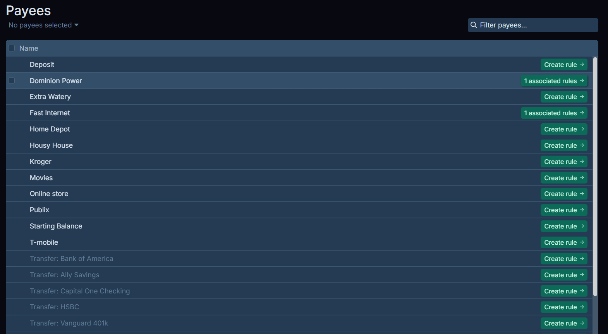

En la imagen se ve el listado de beneficiarios y las opciones para administrarlos. Lo interesante de este módulo es que permite relacionar los movimientos con nombres conocidos. Así, cuando aparece una transacción parecida, es más fácil identificarla y entender a quién corresponde.

Además, este módulo sirve como base para crear reglas automáticas. Eso significa que la aplicación puede aprender patrones o aplicar clasificaciones de forma más rápida, reduciendo el trabajo manual del usuario.

## Módulo de reglas automáticas

El módulo de reglas es uno de los más prácticos, porque automatiza parte del trabajo. En lugar de revisar y acomodar todo manualmente, el usuario puede definir condiciones para que la aplicación clasifique movimientos de manera automática.

	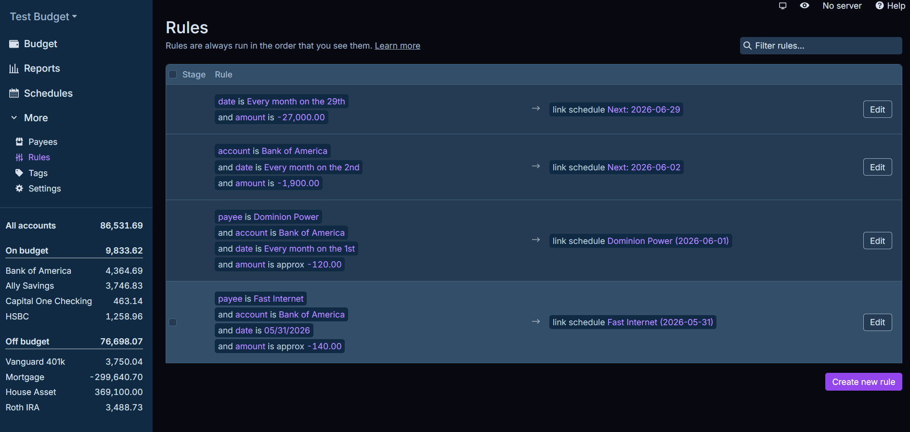

La captura muestra el espacio donde se organizan esas reglas. Este apartado ayuda bastante a mantener todo en orden, sobre todo cuando hay muchas transacciones parecidas. Para nosotros, esta es una función muy valiosa porque hace más rápido el trabajo y reduce errores al clasificar datos.

## Módulo de presupuesto

El presupuesto sirve para planear cuánto dinero se puede gastar en cada categoría. Esta parte es clave en un software de finanzas porque no solo muestra lo que ya pasó, sino que también ayuda a prevenir gastos excesivos.

	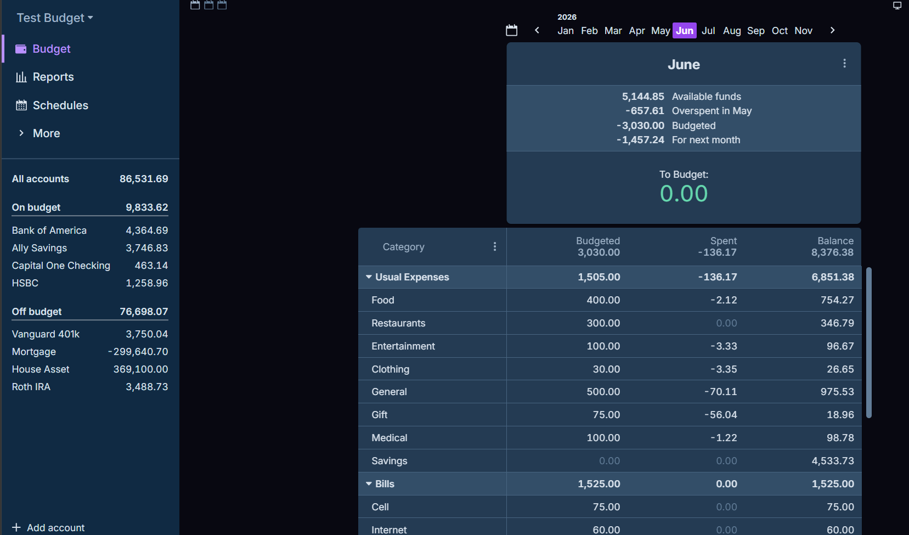

En la imagen se observa la parte del presupuesto con sus categorías y límites. Esto permite que el usuario vea si está gastando demasiado en algo o si todavía tiene margen para seguir usando dinero. Es una herramienta muy útil para organizarse mejor y no perder el control.

## Conclusión

En conclusión, escogimos Actual Budget porque es un software completo, fácil de entender y muy útil para llevar un control real de las finanzas personales. Las imágenes muestran que la aplicación no solo presenta datos, sino que también los organiza de forma clara para que el usuario pueda analizarlos sin complicaciones.

Lo que más nos gustó es que cada módulo cumple una función concreta. Los reportes ayudan a analizar, el calendario permite revisar fechas, las cuentas muestran los movimientos, los beneficiarios ordenan la información, las reglas automatizan tareas y el presupuesto sirve para planificar mejor. Por eso consideramos que este software es una buena opción para manejar el dinero de manera ordenada, simple y con más privacidad.
